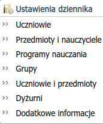
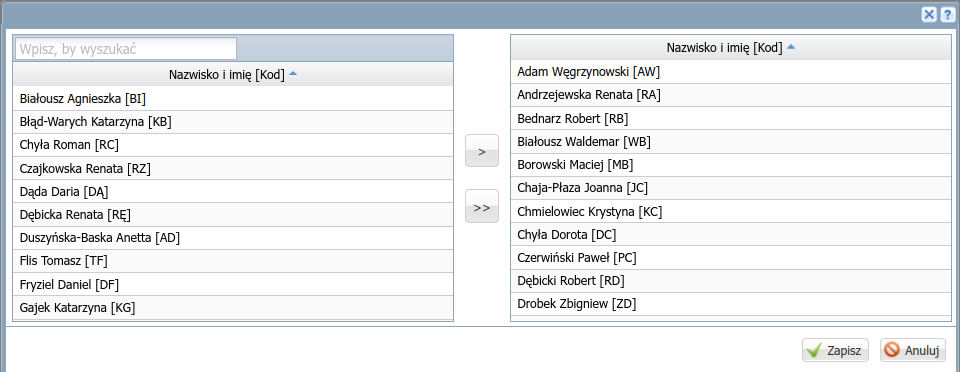
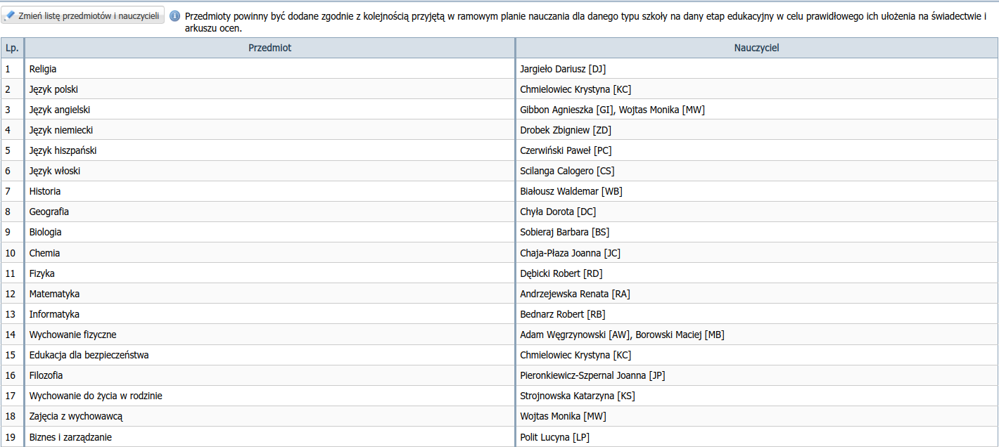
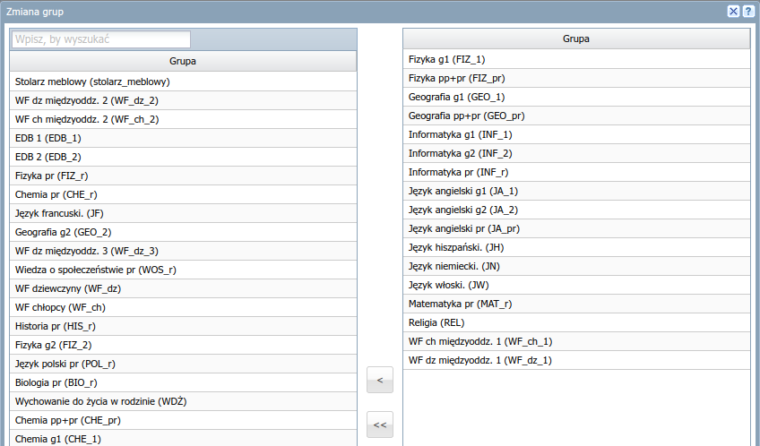
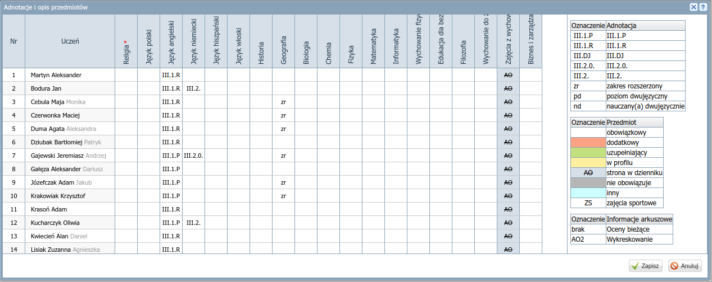

# Konfiguracja dziennika klasy

1) Po zalogowaniu się do dziennika kliknij rozwijalne menu obok swojego nazwiska w prawym górnym rogu i wybierz **Dziennik**.

2) Kliknij ikonę **Dziennik oddziału**, a następnie nazwę swojej klasy w panelu po lewej stronie:

   

3) W sekcji *Ustawienia dziennika* wybierz **Uczniowie**:

   

4) Zweryfikuj listę uczniów, jeżeli trzeba ucznia dodać lub usunąć, kliknij przycisk "Zmień uczniów".

    - Aby dodać ucznia do klasy, przenieś go na prawo (np. dwa razy klikając), aby usunąć – na lewo.
    - W trakcie roku szkolnego możesz również zaznaczyć skreślenie ucznia.
    - Ustal kolejność uczniów za pomocą przycisków strzałek po prawej stronie okna.
    - Zapisz zmiany, kliknij przycisk "Zapisz" w prawym dolnym rogu okna.   

   

5) Jeżeli brakuje ucznia, który powinien być w klasie, zgłoś to do sekretariatu za pomocą modułu *Wiadomości*.

## Przedmioty i nauczyciele

W sekcji *Ustawienia dziennika* wybierz **Przedmioty i nauczyciele**:

   

Następnie kliknij przycisk **Zmień listę przedmiotów i nauczycieli**.

### Przedmioty

1) Kliknij przycisk **Zmiana przedmiotów**.
2) Do prawego panelu przenieś nazwy nauczanych w klasie przedmiotów.
   Przedmioty uporządkuj (za pomocą przycisków strzałek) według kolejności w arkuszu lub na świadectwach.
   Zapisz zmiany, kliknij przycisk **Zapisz** w prawym dolnym rogu okna.

   

   Przykładowa kolejność przedmiotów:

    1. religia / etyka
    2. j. polski
    3. j. angielski
    4. j. niemiecki
    5. j. hiszpański
    6. j. francuski
    7. j. włoski
    8. historia
    9. wos
    10. podstawy przedsiębiorczości
    11. geografia
    12. biologia
    13. chemia
    14. fizyka
    15. matematyka
    16. informatyka
    17. wychowanie fizyczne
    18. edb
    19. filozofia
    20. wdż
    21. zajęcia z wychowawcą
    22. historia i teraźniejszość
    23. biznes i zarządzanie

### Nauczyciele

1) Kliknij przycisk **Zmiana nauczycieli**.
2) Do prawego panelu przenieś nauczycieli uczących w klasie. Zapisz zmiany!

   

### Przypisanie przedmiotów do nauczycieli

1) Przypisz nauczycieli do przedmiotów, kliknij odpowiednią komórkę w tabeli.
   Zapisz zmiany!

    

2) Sprawdź listę przedmiotów i nauczycieli:

    

## Grupy

W sekcji *Ustawienia dziennika* wybierz **Grupy**:

   

### Zmiana listy grup

Kliknij przycisk **Zmień listę grup**.

Na prawą stronę przenieś nazwy grup zgodnie ze wskazówkami:

- **Grupy dodajemy tylko wtedy, kiedy w lekcji nie uczestniczy cała klasa**.
- Dla przedmiotu nauczanego na poziomie podstawowym wybierz grupę(y) z przyrostkiem **_1, _2**, np. **INF_1, INF_2, EDB_1, EDB_2, JA_1, JA_2, ...**
- Dla przedmiotu nauczanego na poziomie rozszerzonym wybierz grupę z przyrostkiem **_r**, np. **INF_r, FIZ_r, MAT_r, GEO_r, WOS_r, HIS_r, POL_r, ...**
- Dla przedmiotu nauczanego w tej samej grupie na poziomie podstawowym i rozszerzonym wybierz grupę z przyrostkiem **_pr**, np. **FIZ_pr, GEO_pr, ...**
- W przypadku innych niz angielski języków obcych wybierz grupy oznaczone **JW, JN, JH, JF**.
- W przypadku wf-u dzielonego w klasie wybierz **WF_dz, WF_ch**.
- W przypadku wf-u międzyoddziałowego wybieramy grupy opisane jako *międzyoddz.*, np. **WF dz międzyoddz. 1**.

Wybór odpowiedniej grupy ułatwia plan lekcji w wersji HTML oraz (tylko teraz) plan lekcji w Mobidzienniku.

### Przykłady wyboru grupy

Interpretacja planu lekcji w [wersji HTML](https://lo1.sandomierz.pl/plany/ostatni/index.html) dla przykładowej klasy 1AB:

|Lekcja|Dzień|Grupy na planie HTML|Grupy w dzienniku Vulcan|
| ------- | ------- | ------- | ------- |
|2|Poniedziałek|r_geografia-1/4 #1gr 57 / r_fizyka-2/4 #fi 73|**GEO_pr** / **FIZ_pr**|
|3|Wtorek|geografia-1/4 #1gp 57 / fizyka-2/4 #fp 73|**GEO_pr** / **FIZ_pr**|
|4|Piątek|fizyka-1/4 #1fp 73 / geografia-2/4 #1g 57|**FIZ_1** / **GEO_1**|
|3|Poniedziałek|r_angielski-1/2 MW 12 / r_informat.-2/2 RB 79|**JA_r** / **INF_r**|
|7|Poniedziałek|r_matematyka-1/4 #1mr 16|**MAT_r**|
|8|Poniedziałek|j.włoski-1/3 #1wl 35 / j.hiszpański-2/3 CP 73 / j.niemiecki-3/3 #1nw 19|**JW** / **JH** / **JN**|
|6|Wtorek|j.angielski-1/3 MW 74 / j.angielski-2/3 #1an ref|**JA_1** / **JA_2**|
|2|Środa|religia DJ 57|**REL_r**|
|8|Czwartek|wf-1/4 #1wd sg3 / wf-4/4 #1wc sg1|**WF_dz_1** / **WF_ch_1**|

**Uwagi:**

1. Kliknięcie linku sali, np. `57`, pozwala zobaczyć, który nauczyciel uczy daną grupę i z których klas składa się dana grupa.
2. Oznaczenia `r_geografia-1/4` i `geografia-1/4` wskazują na tę samą grupę, w Vulcanie wybieramy wtedy jedną grupę, np. **GEO_pr**.
3. Oznaczenia `#1gp` lub `#1gr` informują o poziomie podstawowym lub rozszerzonym przedmiotu.

W bieżącym roku szkolnym podczas wybierania grup możemy wspomóc się analizą planu z Mobidziennika.

1. Np. na 2. lekcji w poniedziałek i 3. lekcji we wtorek widzimy te same grupy z fizyki i geografii, dla których należy wybrać grupy **GEO_pr** / **FIZ_pr**.
2. Na 8. i 9. lekcji w czwartek oraz 8. lekcji w piątek widzimy te same grupy z wf-u, dla których wybieramy oznaczenia **WF_dz_1** / **WF_ch_1** w klasach 1AB i 1DE.

Zapisz zmiany i skontroluj ich poprawność!

### Zmiana przynależności do grup

Kliknij przycisk **Zmień przynależność**.

Przypisz uczniów do grup, kliknij odpowiednie pole w tabeli. Zapisz zmiany!

**Uwagi**:

W bieżącym roku szkolnym skład grup można sprawdzić w Mobidzienniku.

# Uczniowie i przedmioty

W sekcji *Ustawienia dziennika* wybierz **Uczniowie**:

   

Kliknij przycisk **Zmień opis przedmiotów**, aby zmienić oznaczenia poziomu nauczanych języków
oraz wskazać przedmioty realizowane na poziomie rozszerzonym.

Oznacz poziom nauczania języka oraz ewentualny zakres rozszerzony przedmiotu realizowane przez ucznia.
Po zaznaczeniu ucznia i przedmiotu wybierz oznaczenie z prawej strony okna.

Zapisz zmiany!

