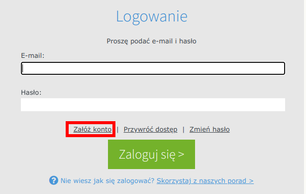
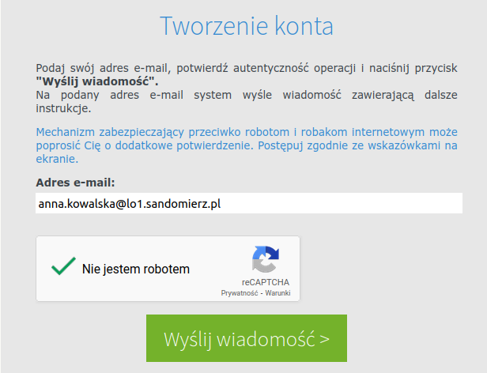
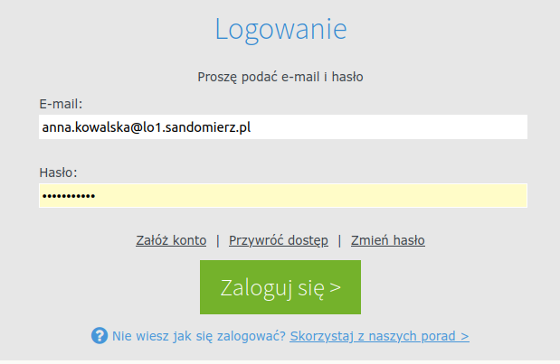

# Założenie i aktywacja konta

1) Otwórz stronę [gmail.com](https://workspace.google.com/intl/pl/gmail/) i zaloguj się na swoje konto szkolne, np.: `anna.kowalska@lo1.sandomierz.pl`
2) W osobnej zakładce wejdź na stronę: [dziennik.vulcan.net.pl/powiatsandomierski](https://dziennik.vulcan.net.pl/powiatsandomierski) i kliknij **Załóż konto**:

3) Wpisz swój szkolny adres email i kliknij *Nie jestem robotem*, a następnie *Wyślij wiadomość >*:

4) Przejdź do poczty swojego konta szkolnego, otwórz otrzymaną z Vulcana wiadomość i kliknij link aktywujący.

5) Utwórz swoje hasło do dziennika Vulcan.

6) Wyloguj się z serwisu Vulcan i z konta szkolnego. Zamknij przeglądarkę!

## Logowanie do dziennika

1) Po uruchomieniu przeglądarki wejdź na stronę: `dziennik.vulcan.net.pl/powiatsandomierski`, wpisz swój szkolny email oraz ustawione hasło. Kliknij *Zaloguj się >*.

