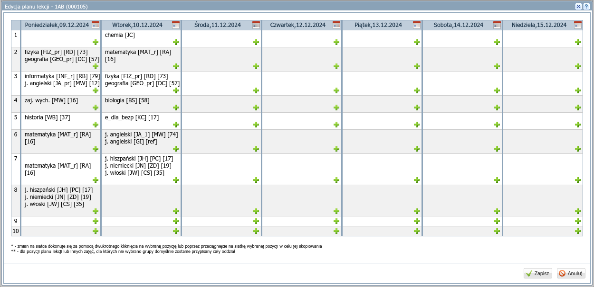

# Wprowadzanie planu klasy

W sekcji *Dane dziennika* wybierz **Plan oddziału**:

1) W sekcji "Plan oddziału" kliknij "Zmień".
2) W oknie "Edycja planu" wprowadź plan dla klasy.

    a) Aby dodać lekcję kliknij ikonę "zielonego znaku plus".
    b) W oknie "Dodawanie pozycji planu lekcji" wybierz przedmiot, nauczyciela, ewentualnie grupę i salę.
    c) Aby dodać lekcję na tej samej godzinie, kliknij ikonę "zielonego znaku plus".
    d) Aby edytować lekcję, kliknij jej nazwę dwa razy.
    e) Aby dodać tę samą lekcję kliknij i przeciągnij ją   

Zapisz zmiany i skontroluj ich poprawność!