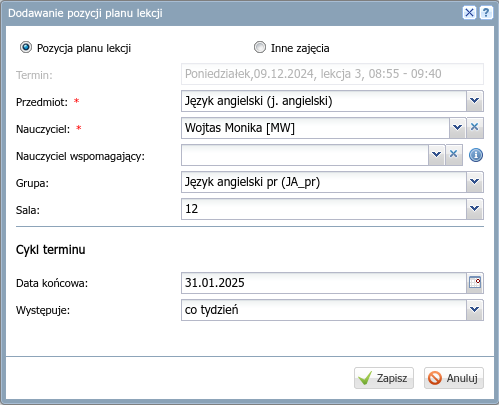

# Wprowadzanie planu klasy

W sekcji *Dane dziennika* wybierz **Plan oddziału**:

1) W sekcji "Plan oddziału" kliknij przycisk "Zmień".
2) W oknie "Edycja planu lekcji" wprowadź plan dla klasy.

     

    - Aby dodać lekcję, kliknij **ikonę zielonego znaku plus**.
    - W oknie "Dodawanie pozycji planu lekcji" wybierz przedmiot, nauczyciela, ewentualnie grupę i salę.
        
        

    - Aby dodać lekcję na tej samej godzinie, kliknij **ikonę zielonego znaku plus**.
    - Aby edytować lekcję, kliknij jej nazwę dwa razy.
    - Aby dodać tę samą lekcję, kliknij i przeciągnij ją.
    - Zapisz zmiany!
