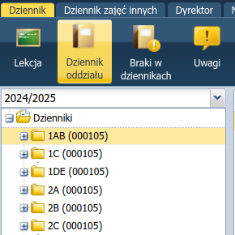
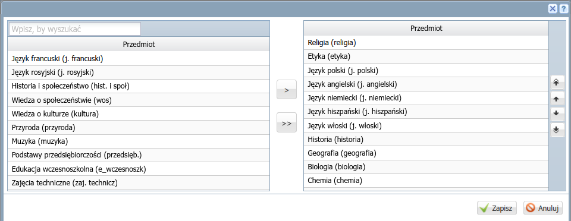
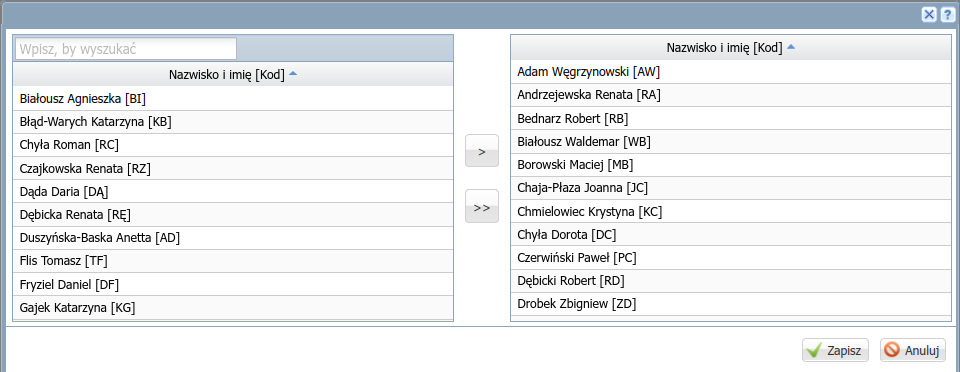
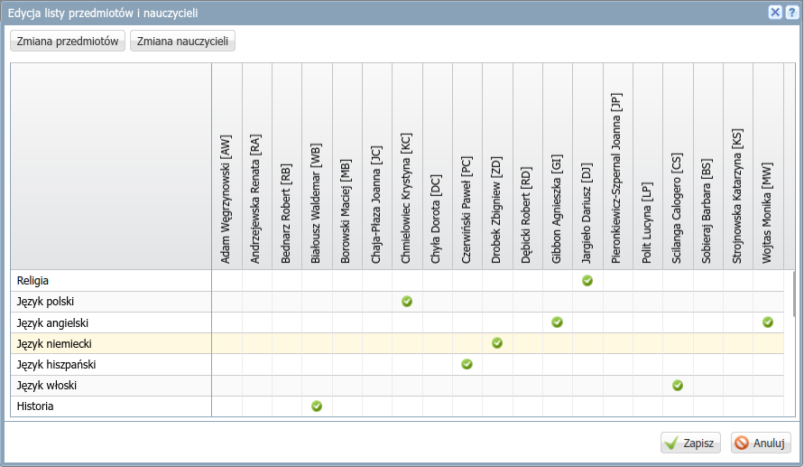
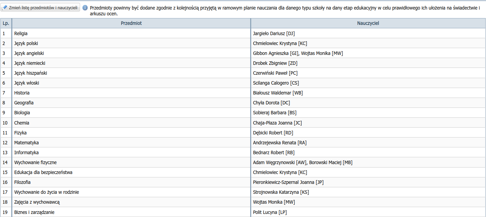
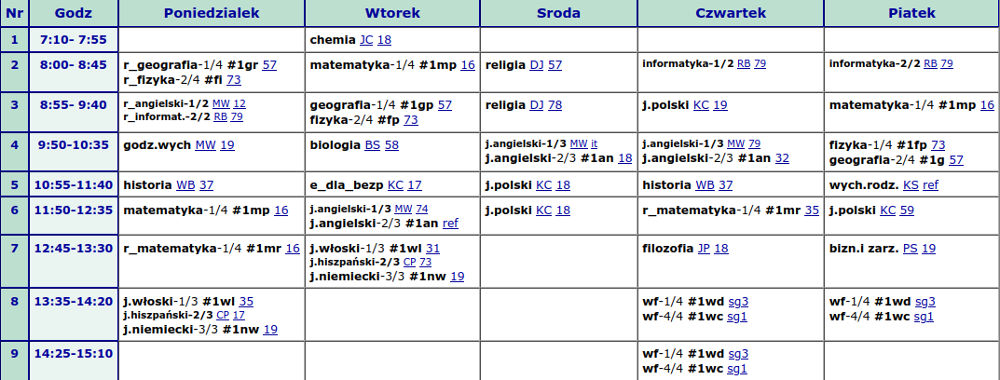
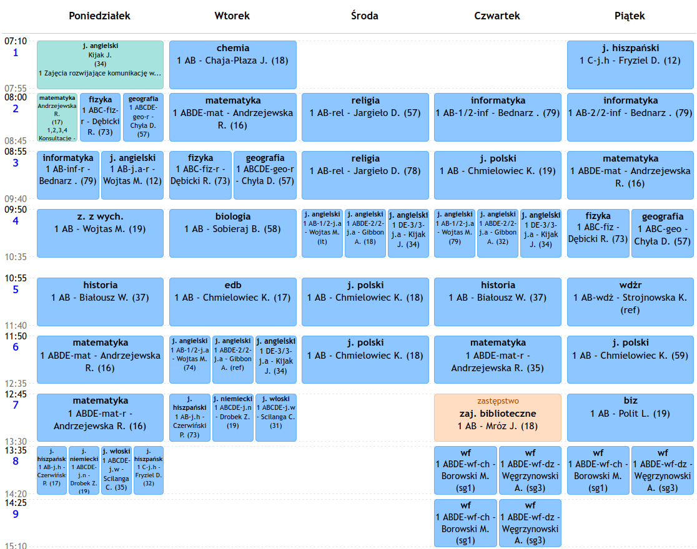
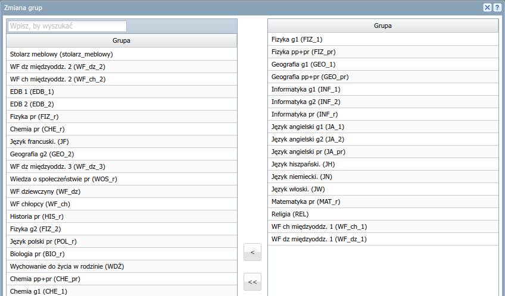
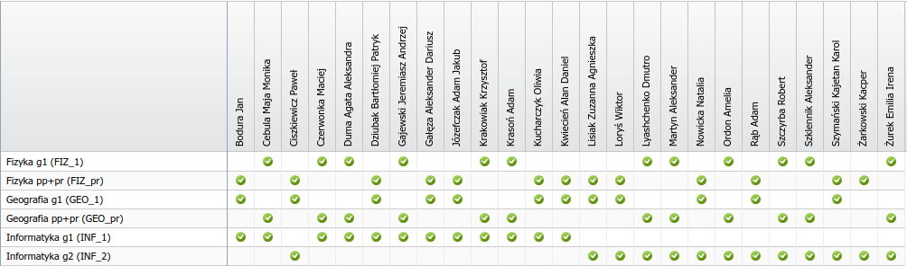
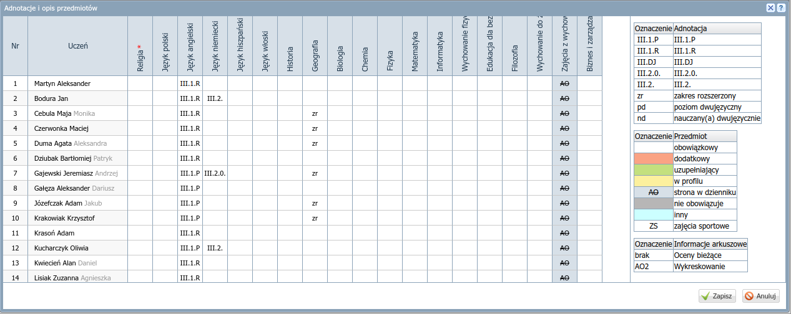

# Konfiguracja dziennika klasy

1) Po zalogowaniu się do dziennika kliknij rozwijalne menu obok swojego nazwiska w prawym górnym rogu i wybierz **Dziennik**.

2) Kliknij ikonę **Dziennik oddziału**, a następnie nazwę swojej klasy w panelu po lewej stronie:

    

3) W sekcji *Ustawienia dziennika* wybierz **Uczniowie**:

    

4) Zweryfikuj listę uczniów, ewentualne niezgodności zgłoś do sekretariatu za pomocą modułu *Wiadomości*.

## Przedmioty i nauczyciele

Wybierz **Przedmioty i nauczyciele** w sekcji *Ustawienia dziennika* i kliknij **Zmień listę przedmiotów i nauczycieli**.

1) Kliknij przycisk **Zmiana przedmiotów**.
2) Do prawego panelu przenieś nazwy nauczanych w klasie przedmiotów (np. dwa razy klikając) i uporządkuj je (za pomocą przycisków strzałek) według kolejności w arkuszu lub na świadectwach. Zapisz zmiany klikając w prawym dolnym rogu przycisk **Zapisz**.
    
3) Kliknij przycisk **Zmiana nauczycieli**.
4) Do prawego panelu przenieś nauczycieli uczących w klasie. Zapisz zmiany!
    
5) Przypisz nauczycieli do przedmiotów. Zapisz zmiany!
    
6) Sprawdź listę przedmiotów i nauczycieli:
    

## Grupy

Wybierz **Grupy** w sekcji *Ustawienia dziennika* i kliknij **Zmień listę grup**.

Do prawego panelu przenieś nazwy grup zgodnie ze wskazówkami:

- Grupy dodajemy tylko wtedy, kiedy w lekcji nie uczestniczy cała klasa.
- Dla przedmiotu nauczanego na poziomie podstawowym wybierz grupy lub grupę z przyrostkiem **_1, _2**, np. **INF_1, INF_2, EDB_1, EDB_2, JA_1, JA_2, ...**
- Dla przedmiotu nauczanego na poziomie rozszerzonym wybierz grupę z przyrostkiem **_r**, np. **INF_r, FIZ_r, MAT_r, GEO_r, WOS_r, HIS_r, POL_r, ...**
- Dla przedmiotu nauczanego w tej samej grupie na poziomie podstawowym i rozszerzonym wybierz grupę z przyrostkiem **_pr**, np. **FIZ_pr, GEO_pr, ...**
- W przypadku innych niz angielski języków obcych wybierz grupy oznaczone **JW, JN, JH, JF**.
- W przypadku wf-u dzielonego w klasie wybierz **WF_dz, WF_ch**.
- W przypadku wf-u międzyoddziałowego wybieramy grupy opisane jako *międzyoddz.*, np. **WF dz międzyoddz. 1**.

Wybór odpowiedniej grupy ułatwia plan lekcji w wersji HTML oraz (tylko teraz) plan lekcji w dotychczasowym dzienniku.

### Przykłady wyboru grupy

Interpretacja planu lekcji w [wersji HTML](https://lo1.sandomierz.pl/plany/ostatni/index.html) dla przykładowej klasy 1AB:

|Lekcja|Dzień|Grupy na planie HTML|Grupy w dzienniku Vulcan|
| ------- | ------- | ------- | ------- |
|2|Poniedziałek|r_geografia-1/4 #1gr 57 / r_fizyka-2/4 #fi 73|**GEO_pr** / **FIZ_pr**|
|3|Wtorek|geografia-1/4 #1gp 57 / fizyka-2/4 #fp 73|**GEO_pr** / **FIZ_pr**|
|4|fizyka-1/4 #1fp 73 / geografia-2/4 #1g 57|**FIZ_1** / **GEO_1**|
|3|Poniedziałek|r_angielski-1/2 MW 12 / r_informat.-2/2 RB 79|**JA_r** / **INF_r**|
|7|Poniedziałek|r_matematyka-1/4 #1mr 16|**MAT_r**|
|8|Poniedziałek|j.włoski-1/3 #1wl 35 / j.hiszpański-2/3 CP 73 / j.niemiecki-3/3 #1nw 19|**JW** / **JH** / **JN**|
|6|Wtorek|j.angielski-1/3 MW 74 / j.angielski-2/3 #1an ref|**JA_1** / **JA_2**|
|2|Środa|religia DJ 57|**REL_r**|
|8|Czwartek|wf-1/4 #1wd sg3 / wf-4/4 #1wc sg1|**WF_dz_1** / **WF_ch_1**|

**Uwagi:**

Jeżeli analizujemy plan w wersji HTML i mamy zapis bez inicjałów nauczyciela,
np. `r_matematyka-1/4 #1mr 16`,  `r_geografia-1/4 #1gr 57`, `geografia-1/4 #1gp 57`,
klikamy link sali, aby zobaczyć który nauczyciel uczy daną grupę i z których klas uczniowie są w danej grupie.

1. Kliknięcie `57` w zapisie `r_geografia-1/4 #1gr 57` i `geografia-1/4 #1gp 57` pokazuje na 2 lekcji w poniedziałek zapis `r_geografia DC 1a/b-1/4,1c-1/4,1d/e-1/4` i 3. lekcji we wtorek zapis `geografia DC 1a/b-1/4,1c-1/4,1d/e-1/4`. To znaczy, że nauczyciel ma symbol `DC` (po kliknięciu zobaczymy imię i nazwisko), grupa jest międzyoddziałowa i realizuje geografię na poziomie podstawowym (we wtorek) i rozszerzonym (w poniedziałek). Z tego wynika, że wychowawcy klas 1AB, 1C i 1DE powinni wybrać tę samą grupę **GEO_pr**.
2. Kliknięcie `16` w zapisie `r_matematyka-1/4 #1mr 16` pokazuje na 6. w poniedziałek lekcji zapis `matematyka RA 1a/b-1/4,1d/e-1/2`. To znaczy, że nauczyciel ma symbol `RA` (po kliknięciu zobaczymy imię i nazwisko) i grupa jest międzyoddziałowa. Z tego wynika, że wychowawcy klas 1AB i 1DE powinni wybrać tę samą grupę **MAT_r**.
3. Kliknięcie `sg3` i `sg1` w zapisach `wf-1/4 #1wd sg3 / wf-4/4 #1wc sg1` pokazuje, że pierwszą grupę uczy nauczyciel `AW`, a drugą `MB` i że są to grupy międzyoddziałowe. Jeżeli dowiemy się, że pierwszy nauczyciel ma dziewczyny, a drugi chłopców, wybieramy grupy **WF_dz_1** / **WF_ch_1** w klasach 1AB i 1DE.

W bieżącym roku szkolnym podczas wybierania grup możemy wspomóc się analizą planu z Mobidziennika.

1. Na 2. lekcji w poniedziałek i 3. lekcji we wtorek widzimy te same grupy z fizyki i geografii (fizyka
1 ABC-fiz-r - Dębicki R. (73) / geografia 1 ABCDE-geo-r - Chyła D. (57)), co potwierdza, że są to uczniowie realizujący przedmioty na poziomie podstawowym i rozszerzonym, dla których należy wybrać grupy **GEO_pr** / **FIZ_pr**.
2. Na 8. i 9. lekcji w czwartek oraz 8. lekcji w piątek widzimy te same grupy z wf-u (wf 1 ABDE-wf-ch - Borowski M. (sg1) / wf 1 ABDE-wf-dz - Węgrzynowski A. (sg3)), co potwierdza, że są to międzyoddziałowe grupy dziewczyn i chłopców, dla których wybieramy oznaczenia **WF_dz_1** / **WF_ch_1** w klasach 1AB i 1DE.

Zapisz miany i skontroluj poprawność zmian!

## Przynależność do grup

Wybierz **Grupy** w sekcji *Ustawienia dziennika* i kliknij **Zmień przynależność**.

Przypisz uczniów do grup klikając odpowiednie pole.

**Uwagi**:

W bieżącym roku szkolnym skład grup można sprawdzić w Mobidzienniku. 

Zapisz zmiany!

# Uczniowie i przedmioty

Wybierz **Uczniowie i przedmioty** w sekcji *Ustawienia dziennika* i kliknij **Zmień opis przedmiotów**.

Oznacz poziom nauczania języka oraz ewentualny zakres rozszerzony przedmiotu realizowane przez ucznia.
Po zaznaczeniu ucznia i przedmiotu wybierz oznaczenie z prawej strony okna.

Zapisz miany i skontroluj poprawność zmian!

11) Uczniowie i przedmioty
12) Plan oddziału
