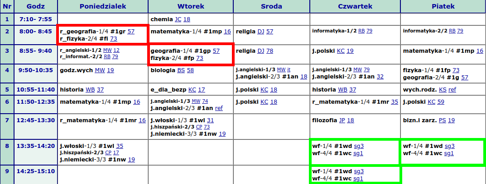

# Konfiguracja dziennika klasy

1) Po zalogowaniu się do dziennika kliknij rozwijalne menu obok swojego nazwiska w prawym górnym rogu i wybierz **Dziennik**.
2) Kliknij ikonę **Dziennik oddziału**, a następnie nazwę swojej klasy w panelu po lewej stronie:

    

3) W sekcji *Ustawienia dziennika* wybierz **Uczniowie**:

    

4) Zweryfikuj listę uczniów, ewentualne niezgodności zgłoś do sekretariatu za pomocą modułu *Wiadomości*.

## Przedmioty i nauczyciele

Wybierz **Przedmioty i nauczyciele** w sekcji *Ustawienia dziennika* i kliknij **Zmień listę przedmiotów i nauczycieli**.

1) Kliknij przycisk **Zmiana przedmiotów**.
2) Do prawego panelu przenieś nazwy nauczanych w klasie przedmiotów (np. dwa razy klikając) i uporządkuj je (za pomocą przycisków strzałek) według kolejności w arkuszu lub na świadectwach.
    Zapisz zmiany klikając w prawym dolnym rogu przycisk **Zapisz**.
    
3) Kliknij przycisk **Zmiana nauczycieli**.
4) Do prawego panelu przenieś nauczycieli uczących w klasie. Zapisz zmiany!
    
5) Przypisz nauczycieli do przedmiotów. Zapisz zmiany!
    
6) Sprawdź listę przedmiotów i nauczycieli:
    

## Grupy

Wybierz **Grupy** w sekcji *Ustawienia dziennika* i kliknij **Zmień listę grup**.

Do prawego panelu przenieś nazwy grup zgodnie ze wskazówkami:

- Grupy dodajemy tylko wtedy, kiedy w lekcji nie uczestniczy cała klasa.
- Dla przedmiotu nauczanego na poziomie podstawowym wybierz grupy lub grupę z przyrostkiem **_1, _2**, np. **INF_1, INF_2, EDB_1, EDB_2, JA_1, JA_2, ...**
- Dla przedmiotu nauczanego na poziomie rozszerzonym wybierz grupę z przyrostkiem **_r**, np. **INF_r, FIZ_r, MAT_r, GEO_r, WOS_r, HIS_r, POL_r, ...**
- Dla przedmiotu nauczanego w tej samej grupie na poziomie podstawowym i rozszerzonym wybierz grupę z przyrostkiem **_pr**, np. **FIZ_pr, GEO_pr, ...**
- W przypadku innych niz angielski języków obcych wybierz grupy oznaczone **JW, JN, JH, JF**.
- W przypadku wf-u dzielonego w klasie wybierz **WF_dz, WF_ch**.
- W przypadku wf-u międzyoddziałowego wybieramy grupy opisane jako *międzyoddz.*, np. **WF dz międzyoddz. 1**.

Wybór odpowiedniej grupy ułatwia plan lekcji w wersji HTML oraz (tylko teraz) plan lekcji w dotychczasowym dzienniku.

### Przykłady doboru grupy

Plan klasy 1AB w HTML-u:

    

|Lekcja|Dzień|Grupy na planie|Grupy w dzienniku|
| ------- | ------- | ------- | ------- |
|2|Poniedziałek|r_geografia-1/4 #1gr, r_fizyka-2/4 #fi|**GEO_r** i **FIZ_r**|

9) Zmień listę grup
10) Przypisanie uczniów do grup
11) Uczniowie i przedmioty
12) Plan oddziału
